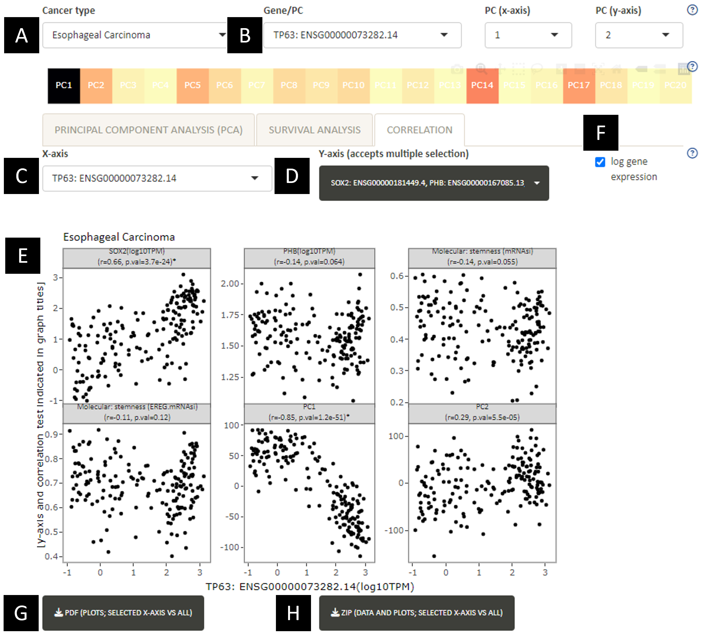

**A.** Switch between input cancer types.\
**B.** Switch between input genes.\
**C.** X-axis value (choose between selected sample annotation, gene expression and PCs) for making the correlation plot (E).\
**D.** Y-axis value (choose between selected sample annotation, gene expression and PCs) for making the correlation plot (E). Multiple values can be selected for Y-axis.\
**E.** Correlation plot between selected values (C and D). The y-axis label and Pearson correlation coefficient (r) and associated p-value are indicated in the subplot titles. P-values < 1E-20 are indicated by an asterisk.\
**F.** Gene expression values are typically displayed in a log10 scale, which is calculated by adding 0.1 to transcript per million (TPM) before log10 transformation. Users can untick the box to go back to a linear scale.\
**G.** Download scatter plots comparing selected x-axis with all variables (a maximum of 30) for all cancers.\
**H.** Download scatter plots comparing selected x-axis with all variables (a maximum of 30) for all cancers, along with the data used for the plots and the Pearson correlation results table.\
