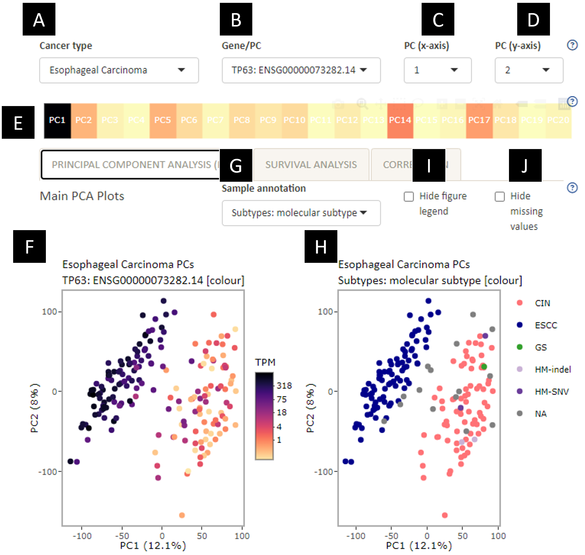

**A.** Switch between input cancer types.\
**B.** Switch between input genes, signature (log average of input genes) or principal component (PC).\
**C.** The PC number for the x-axis of PCA plots (F and H).\
**D.** The PC number for the y-axis of PCA plots (F and H).\
**E.** The % contribution for the selected gene towards each principal component (PC).\
**F.** PCA plot. X-axis is the selected PC in D. Y-axis is the selected PC in E. Each dot represents a sample, coloured by selected gene (B). You can save the plot by hovering over the graph and clicking on the camera button.\
**G.** Switch between sample annotations for PCA plots (H and L; please refer to the help file under Additional PCA plots for details on plot L). \
**H.** PCA plot. X-axis is the selected PC in D. Y-axis is the selected PC in E. Each dot represents a sample, coloured by selected sample annotation (G). For categorical annotations, you can hide specific groups by clicking on their annotations in the legend. You can save the plot by hovering over the graph and clicking on the camera button.\
**I.** Hide figure legend for PCA plot coloured by sample annotation (H). This is for ease of seeing the plots when some annotations are long.\
**J.** Hide data that are not available (NA) in the PCA plot coloured by sample annotation (H). This is for ease of seeing the plots when there are a lot of missing values.
