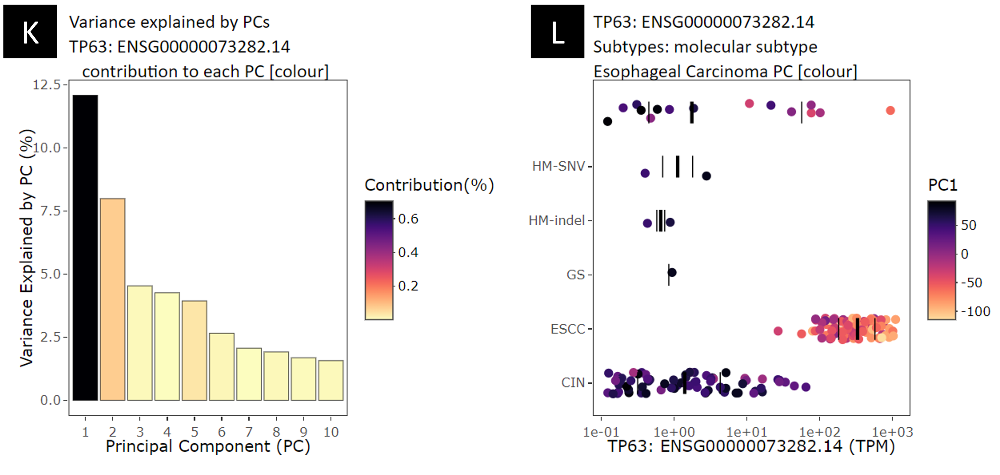

**K.** Scree plot showing how much variation each principal component (PC) captures (y-axis). The % contribution from the selected gene is used to colour the plot. You can save the plot by hovering over the graph and clicking on the camera button.\
**L.** Dot plot plotting gene expression in log scale (x-axis) versus selected sample annotation (y-axis). Dots are coloured by the selected PC-y-axis (in this case, PC1). You can save the plot by hovering over the graph and clicking on the camera button.