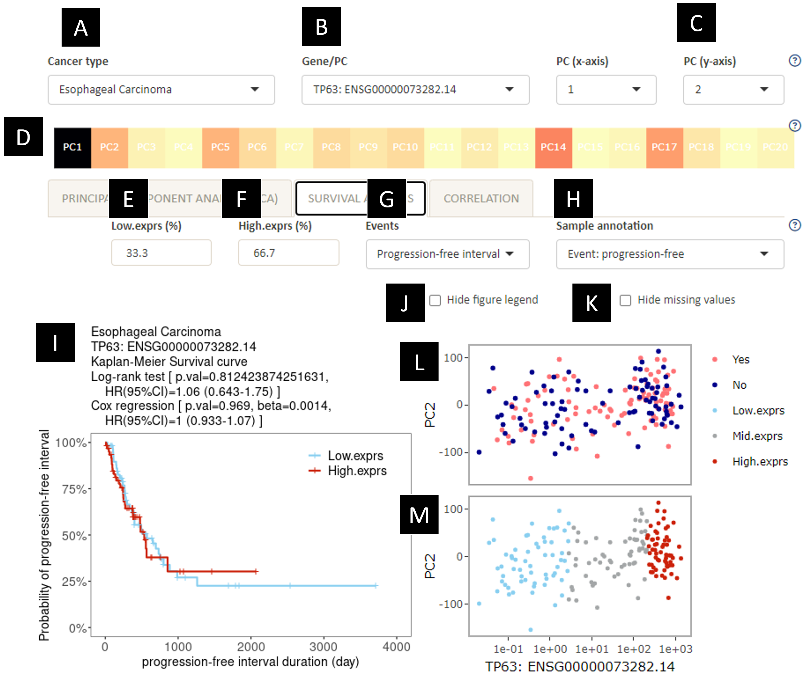

**A.** Switch between input cancer types.\
**B.** Switch between input genes, signature (log average of input genes) or principal component (PC).\
**C.** The PC number for the y-axis of the dot plots (L and M).\
**D.** The % contribution for the selected gene (B) towards each principal component (PC).\
**E.** The gene expression threshold to use to be considered as low level of expression (default: lower or equal to 33.3% samples).\
**F.** The gene expression threshold to use to be considered as a high level of expression (default: higher than 66.7% of samples).\
**G.** Switch between progression-free interval and overall survival for Kaplan-Meier plot and survival analysis.\
**H.** Switch between sample annotations for dot plot(L). \
**I.** Kaplan-Meier plot. The results for the Log-rank test and Cox regression tests are listed in the plot title. Note that for Cox regression, the gene expression values are converted into log scale if 1) the smallest value is zero or higher. If the smallest value is zero, 0.1 is added before log-transformation.\
**J.** Hide figure legend for dot plot coloured by sample annotation (L). This is for ease of seeing the plots when some annotations are long.\
**K.** Hide data that are not available (NA) in the dot plot coloured by sample annotation (L). This is for ease of seeing the plots when there are a lot of missing values.
**L.** Dot plot for plotting expression levels for the selected gene (B) selected PC (C, y-axis), coloured by selected sample annotation (H).\
**M.** Dot plot for plotting expression levels for the selected gene (B) selected PC (C, y-axis), coloured by the cutoffs for low and high expression thresholds (E and F) used in the Kaplan-Meier plot (I).\
