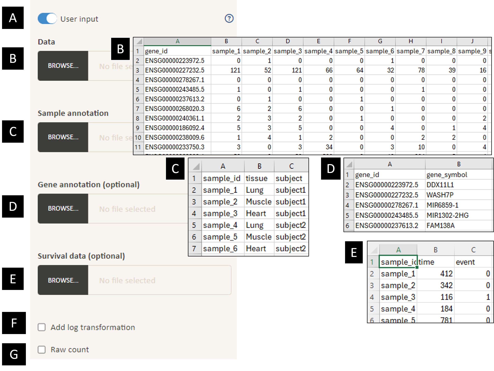

**A.** Switch between analysing user input and TCGA cancer projects. \
**B.** (Required for analysis using user input) Upload data for PCA and correlation analysis. For gene expression data, the first column would be gene IDs, and the first row would be sample IDs. The values in the first column and the first row must be unique (i.e. no duplicated values). Avoid using spaces or special characters in them; dashes will be replaced by underscore. Example input data shown on the right (data from GTEx project; https://gtexportal.org/). \
**C.** (Required for analysis using user input) Upload sample annotation for PCA and correlation analysis. Values in the first column must be unique (duplicate rows will be removed); these values are used to match the column names in B. Example input sample annotation shown on the right. \
**D.** (Optional for analysis using user input) Upload gene annotation for PCA and correlation analysis. Values in the first column must be unique (duplicate rows will be removed). Example input data shown on the right.\
**E.** Apply log10 transformation to the input data. This will be ignored if the smallest value in the input data is less than 0, and 0.1 will be added to all values in the dataset before transformation if the smallest value in the input data is 0.\
**F.** Select this option if the input data is raw gene count. By doing so edgeR pipeline will be used to process the data and displayed values will be normalised log cpm (count per million).

You can download example input files from https://github.com/bshihlab/evergene.